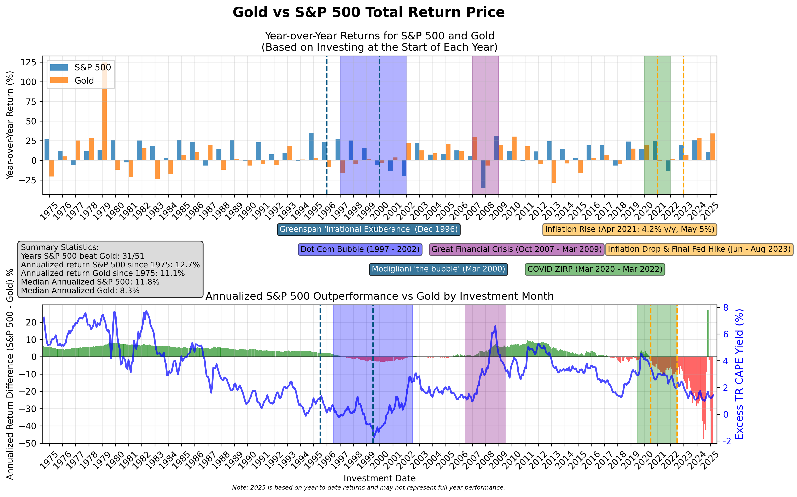

Gold crossed $4,000 per troy ounce on October 7th. Given this milestone, I wanted to investigate the claim that gold is a better investment than the S&P500. When people usually share their charts showing Gold versus the S&P500 _index_, there are a few biases I've always noticed. Of course, the same day I started doing my analysis on this topic, CNBC puts out an article [gold vs. sp500 long term returns](https://www.cnbc.com/2025/10/08/gold-vs-sp500-returns.html).

1. The most egregious bias in my opinion, is the investment year is cherry-picked (e.g. peak of the dot-com bubble in 2000), and along it comparing against NASDAQ instead of the S&P500. To account for this bias, I have charted the difference in returns for all years, and annualized them to make teh results more digestible, since total returns aren't comparable across years.
2. Another bias is that people will cherry pick years very long ago without accounting for executive order 6102 which prohibited owning gold from 1933 until the "International Development Association Appropriations Act of 1975" was passed, legalizing owning gold starting from January 1st, 1975. This bias is accounted for by restricting the time frame from January 1st, 1975 to the most recent data available for comparison (September 1st, 2025).
3. A third bias is comparing against the S&P500 index rather than teh S&P500 total return index which incorporates dividends reinvested. Big shout out to Robert Shiller for maintaining this dataset for us.

End date: Sep-2025.

Overall, since 1975, the S&P 500 manages to outperform gold on a y/y basis 70% of the time (note that this is based on investing at the start of the year). The cool thing about gold is that it has a Beta coefficient of around 0.5 (Yahoo, using GLD ETF as a proxy).

After creating the initial plots which show the performance for the two different types of investments, I noticed that since 1997 to the present day (include the monster returns of 2024 and 2025), there are periods where an investment in gold - a zero-cashflow generating asset - would've outperformed the S&P500 - cash flow generating securities. After that there are periods where an investment in the S&P500 would've outperformed gold. This makes some sense once you factor in that gold is not correlated to S&P500. Once the market crashed and started going up in March 2009, due to the great financial crisis, there was opportunity to shift from gold into the market.

If we use a 10-year window, the results are bit more different, suggesting that over the long-term the S&P500 will outperform gold. The periods where the S&P500 outperforms are taller and the dot-com bursts are deeper compared to the all time annualized performance, however even on a 10 year period the pre-1995 bull market provided excess returns over gold as well as the post-GFC bull market. These make it very clear that gold is not a buy always hold forever instrument but rather an instrument to bring into play when investors speculate that the risk-free real interest rates is lower than what they desire.

There was definitely a year (2012) where you should've sold gold for bonds or stocks. The year is 2012 and inflation starts dipping below 2%. The Feds start cutting rates, however its clear that holding USD will provide a provide a positive enough risk-free real rate of return. So what happens to gold? It falls to its "fair value" and stays there since inflation is being tamed, as made clear with interest rates rising from 2016 to 2019.

The questions that arise after looking at the graphs are why is gold going up in 2024 and 2025, whether this is similar to 2012, how to avoid another dot-com bubble situation, and lastly, how do we know when the top is in regarding the business/debt cycle.

## Analysis

### Gold Surge in 2024 and 2025

As illustrated in the provided charts, the gold price rise seems to be a reflection of both the  **declining confidence** in the Federal Reserve's ability to control inflation as well as its status as a safe haven asset.

Gold is inversely correlated with the expected risk-free real interest rate. Gold is also seen as a safe-haven asset. Meaning that the real interest rate could be flat, but the existence of some fear, like tariffs, could cause mass buying of gold. What factors determine the expected risk-free real interest rate?

- The expected inflation rate
  - [increase in deficit](https://www.bnnbloomberg.ca/business/2025/08/20/us-budget-deficit-forecast-us1-trillion-higher-over-next-decade-watchdog-says/)
  - Tariffs (import prices are higher)
- Treasury Yields (1yr or 10yr)
  - The Feds Fund rate

[Treasury yields and gold prices: breaking expectations (March 25, 2025)](https://www.spglobal.com/market-intelligence/en/news-insights/research/treasury-yields-and-gold-prices-breaking-expectations)

If you look at the inflation data, the 1yr treasury bill yields, and the actual Feds Fund rates, a relationship can somewhat be determined between expected inflation, expected risk-free real interest rates, and thus gold prices. When the expected risk-free real interest rate falls, gold is viewed as the stronger store of value. This seems to be because treasuries get crowded out due to a [lag](https://www.bankofcanada.ca/2025/10/staff-analytical-note-2025-25/#Money-market-mutual-funds-have-experienced-high-growth) in people pulling money out of money market funds as interest rates get cut. The lag is 1yr.

### Fisher's Equation and Real Interest Rates

This concept of real interest rates comes from the [Fisher equation](/posts/bu-473-investment-management#interest-rates-and-inflation-rates).

The "real risk-free required rate of return" varies by investor type. This is possibly due to differences in taxation. If all participants seek similar post-tax real rates of return, then where they are situated may affect how the bid on securities, and if the market is small enough, it may crowd out investors with higher marginal tax rates.

- **Geographic Tax Advantages**: Institutions based in zero-tax jurisdictions could drive down pre-tax real returns for all market participants to match their own post-tax expectations.
- **Commodity Allocation**: institutions are less likely to be able to crowd out commodities like gold, thus it gives all investors ane better chance at pursuing investments that meet their desired risk-free real rates of return when treasury bills don't meet the bar.

### Current Market Assessment

**Gold Outlook** Based on the Gold Price to S&P 500 Total Return Price Ratio over the last 30 years, a gold price crash appears unlikely.

**S&P 500 Valuation** (Chart 2): The TR CAPE excess yield metric suggests the S&P 500 is not currently in a speculative bubble. This metric compares the yield of the S&P 500 Total Return Cyclically Adjusted Price-to-Earnings (TR CAPE) ratio against the inflation-adjusted 10-year Treasury yield.

The TR CAPE excess yield metric is the difference between the yield of the SP500 Total Return Cyclically Adjusted Price to Earnings (TR CAPE) ratio minus the 10-year Treasury yield adjusted for inflation. The implication is that when treasuries offer a better real return than the market, the market is definitely in a bubble since it would be be poised to underperform treasuries on a real basis for the next 10 years. That or it would require a long-term sustaining bubble.

CAPE takes into account the business cycle and TR takes into account the various method of returning cash to shareholders (dividends, buybacks, etc)

### Systemic Crashes

The stock market crashing is systemic. There are multiple factors at play.

- Business Cycles
  - When a business cycle is going down, it is called a recession
  - Employment data
    - Employment ratios will go up and down just due to the nature of a business cycle
    - The business cycle is what central banks are tasked at shortening, however it is not a solved problem
    - Personally I think recessions are characterized based on the employment data because unemployment is the problem, not a fall in economic growth. If economic growth exists and people are unemployed, then there is still a crisis because people are struggling.
    - Regardless, a traditional GDP based recession metric is clearly a follow up on a decrease in employment, where the recession becomes a reality if the loss in jobs is long-enough to cause a decrease in consumption, which would result in a decrease in earnings, which decreases stock prices
  - Debt crisis
    - A recession becomes a debt crisis when a lot of capital is tied to "never ending growth"
    - A debt crisis occurs when a lot of capital is tied to being owed money from over-leveraged entities who can go under due to even the smallest of mishaps. In the GFC, the subprime mortgage instrument combined with over-leverage meant that a minor real estate correction would wipe out the Lehman Brothers, and of course a fall in employment is going to prevent real estate from continuing to go up.
- Black swan events (e.g. lockdowns)
- An increase in the possibility of a black swan event (e.g. COVID-19)
- Sharp rise in interest rates causing valuations to plummet due to a higher required rate of return
  - In 2023, interest rates stopped rising. This in turn started a bull market due to risk-premiums being fixed. As interest rates were hiked in 2022, the market risk-premium necessitates that the required rate of return is higher. When the required rate of return rises without the stock market already having corrected, a rise in the required rate of return (based on expectations not just rate announcements), would immediately cause downward pressure on stocks.

## Looking Forward

I want to pursue live graphs that show a simple risk factor as to how likely forward earnings will miss expectations (and thus cause a systemic crash) barring external and black swan events. On top of that, because systemic crashes cause even good stocks to go down, there needs to be a super simple tool that can figure out which stocks were oversold. In a market crash, one of the reasons for asset sales is the lack of liquidity itself! Stock valuations aren't just a reflection of fundamentals but also of liquidity (supply & demand). Some factors that are interesting to me are:

- inflation (to predict interest rate announcements, however bank analysts will probably do this themselves)
- jobs data (to predict and visualize where the economy is in the business cycle)
- risk-free interest rates (to know what the market's required rate of return is)
  - the required rate of return is a combination of Beta, equity-risk premium, and the risk-free return. The equity risk-premium is not necessarily static, however it must be a positive number. My theory is that it depends on the various opportunity costs available at any point in time. As time goes forward and as investment innovations increase, equity-risk premiums should be rising, however they can fluctuate due to government policies providing or removing incentives for certain industries and sectors. We must also be aware that the equity risk premium is affected by investable wealth. Meaning that the larger the security in terms of market capitalization, the lower the equity risk premium is to compensate for the fact that more capital to invest also means less available investments.
- 10 year treasury prices and yield versus gold (specifically for analyzing periods of distress)

## Historical Perspectives on Market Valuations

Several prominent economists have warned about speculative bubbles and irrational market behavior:

**Alan Greenspan** (December 5, 1996, "The Challenge of Central Banking in a Democratic Society"):
> "Sustained low inflation implies less uncertainty about the future, and lower risk premiums imply higher prices of stocks and other earning assets... But how do we know when irrational exuberance has unduly escalated asset values, which then become subject to unexpected and prolonged contractions as they have in Japan over the past decade?"

**Franco Modigliani**, Nobel Laureate (March 30, 2000, New York Times):
> "The expectation of growth produces the growth, which confirms the expectation; people will buy it because it went up. But once you are convinced that it is not growing anymore, nobody wants to hold a stock because it is overvalued."

**Robert Shiller** (_Irrational Exuberance_, 2000):
> "Irrational exuberance is the psychological basis of a speculative bubble... news of price increases spurs investor enthusiasm, which spreads by psychological contagion from person to person... bringing in a larger and larger class of investors who, despite doubts about the real value of an investment, are drawn to it partly by envy of others' successes and partly through a gamblers' excitement."

## Reproducing Results

- [Gold Prices from Macrotrends](https://www.macrotrends.net/1333/historical-gold-prices-100-year-chart)
- [S&P Total Price Return from Shiller Data](https://shillerdata.com/) (ie_data.xls)

The Pythons script for producing the results can be found in my [python-finance-library](https://github.com/elibroftw/python-finance-library/blob/master/src/gold.py)
