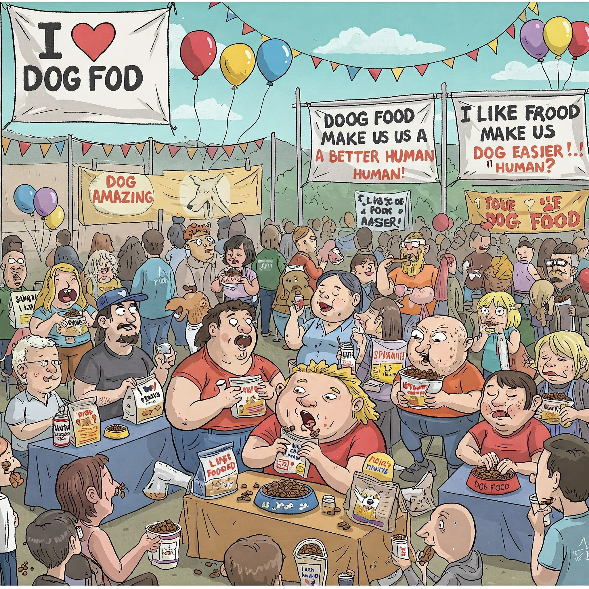

When I saw the sign for "Dog Food Eating Convention," curiosity drew me in. As a human who takes pleasure from human food, I was interested in why someone would enjoy eating dog food. The scene inside was immediately striking, punctuated by banners and booths proclaiming bizarre devotion:

"I loooove dogfood"

"Dogfood is amazing"

"Dogfood makes us a better human"

"Dogfood makes life easier"

"I like the smell of dog food."

---

## Backstory

I came up with this satirical story while talking to my dad on the phone two months ago in March. I'm not sure what the conversation was specifically about, but it's definitely related to echo chambers and how it feels to be an outsider entering one. It's straight up hard to grasp the perspective of those in an echo chamber, because the people in them are so used to "persuading" their own (i.e. preaching to the choir) instead of talking to people outside of the echo chamber. This is how we end up in a situation like the [following](https://www.reddit.com/r/TorontoRealEstate/comments/1k5npba/comment/mojtq1a/?utm_source=share&utm_medium=web3x&utm_name=web3xcss&utm_term=1&utm_content=share_button):

> Housing prices rose at the literal exact same rate as a percentage under Harper as they did under Trudeau. Any expert I’ve talked to has told me this has been a multi-decade issue that has been steadily getting worse, and again, the data shows it’s been getting consistently worse at the SAME RATE PRE & POST TRUDEAU.

Whereas if we track affordable housing using WHAM, we can see something that shows how absolutely incorrect this comment was in a REAL ESTATE forum.

If you pay attention to the maroon line, you can see how stable and flat it was until 2016, coinciding with a change in government.

This also shows that certain cities have only gotten worse since Trudeau. Cities like London were once known to be affordable but are now stupidly expensive; the WHAM for London went from ~110 in 2015 to ~240 in 2024!. That's more than double in terms of worsening affordability.
